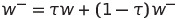
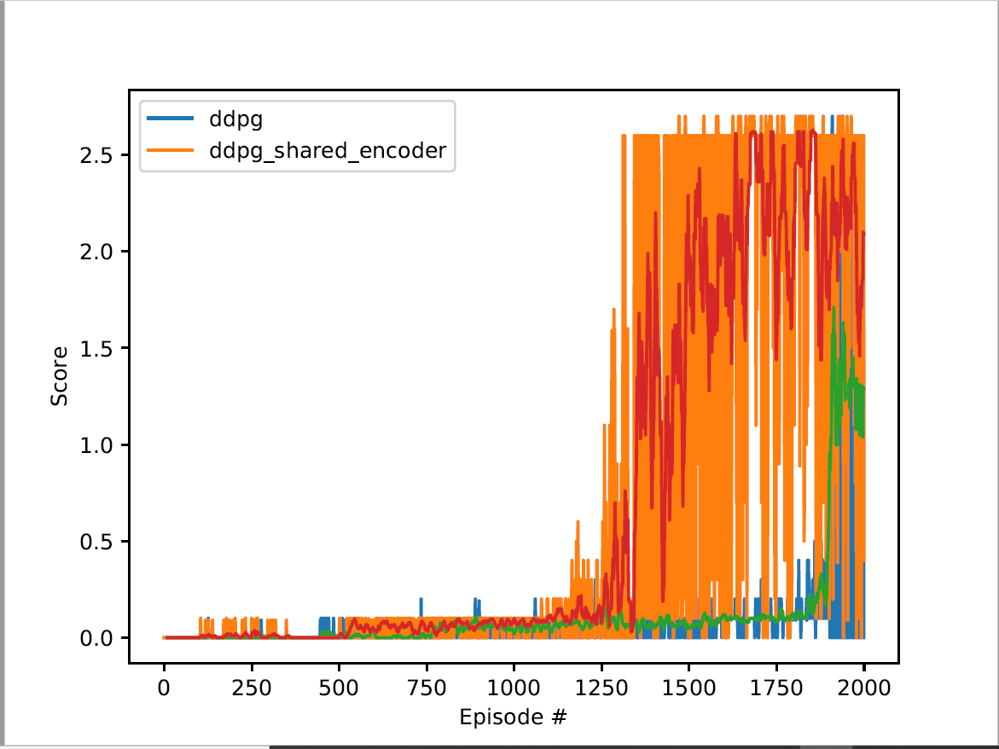

# Implementation details
In order to implement the DDPG strategy, we developed the following classes:
* **MultiAgent**: It is responsible of processing the environment experiences, defines the agents that participate on
 the environment and keeps the experiences on a replay buffer.
* **Agent**: It implements a single agent, defines the background neural networks and carries out the learning process
based on the experiencies given as input.
* **ReplayBuffer**: It is the storage used for saving and sampling the experiences collected from the environment.
* **OUNoise**: This class implements an Ornstein-Uhlenbeck process. This process is used to add noise to the output of 
the actor network. This mechanismus is used to enable space exploration for gaining new knowledge and avoid 
 over-explotation of the current knowledge.  
* **Actor**: This class implements the neural network used as actor, i.e. the neural network that decides, given a 
state, which is next action to follow.
* **ActorHead**: Similar to the previous one with the ability of sharing the first layer with other networks, e.g. with
**CriticHead**.
* **Critic**: It describes the neural network used as critic. The critic delivers the value of a given state-action 
pair.
* **CriticHead**: Similar to the previous one with the ability of sharing the first layer with other networks, e.g. with
**ActorHead**. 
* **NetworkEncoder**: It represents the first part of the network, in this case is only one layer, which is shared
among **ActorHead** and **CriticHead**.

  
The **MultiAgent** is the orchestrator of the learning process. In the particular case of the tennis environment it 
defines two agents. Each agent is given its local state observation as input before taking each action. Thus, each agent
learns independently of the other one. They do not share any networks nor weights, though the internal network 
architecture is identical.

The **Agent** class defines four neural networks:
* **actor_local**: It corresponds to the actor neural network that, after the training is finished, will be used for 
prediction. Given a state, this networks returns the action to be performed.
* **actor_target**: This neural network has the same structure as actor_local and is used to implement the fixed target 
strategy, which increases the stability of the learning process. Thus, it represents a time-delayed copy of actor_local. 
* **critic_local**: It corresponds to the critic neural network that, once the training is finished, will be used for
 prediction. Given a state and an action, this neural network returns an estimation of the value of the Q(s, a) function. 
* **critic_target**: Similarly to actor_target, this network represents a time-delayed copy of critic_local and is 
needed for implementing the fixed target strategy.

During training, we used two loss functions:
* The critic network uses the mean squared error as loss function. Thus, it is intended that this networks learns to 
estimates accurated values of the Q(s, a) function. The target values when computing the loss functions are calculated
with the Bellman's equation.
* The actor_network uses as loss is defined as `-critic_local(s, predicted_actions)`, where 
`predicted_actions = actor_local(s)`. Thus, we intend that the actor network predicts actions that maximizes the Q 
values. 

The agent collects experiences in the replay experience buffer and only learns from them after the memory contains at 
least BATCH_SIZE experiences. Then, the learning function is called 3 times by agent every 2 steps. We also tried the 
same configuration that we used in the reacher environment (10 times learning after 20 steps). However, with this 
configuration we couldn't see any improvement on the average score after 700 episodes. Thus, we decided to update the 
weights more ofently and therefore we reduced the amount of waiting steps. 

The target networks are updated following the soft update strategy with the below formula:



where &Tau; is a value in `(0, 1)`. Thus, we move the weights of the target networks in the same direction as the weight 
from the local ones but with lower speed. The lower TAU is, the faster converge the local and the target networks

The `act` function implements an epsilon-greedy strategy. Unlike in discrete action spaces, we can't select a random 
action here. Therefore, we add some noise to the continuous output of our network. The noise is generated with an
Ornstein-Uhlenbeck process. The amount of noise is controlled by the EPSILON_NOISE variable.

At the beginning, we want the agent to explore different actions. Thus, we initialize `EPSILON_NOISE=1.0`. We want to 
reduce the exploration along the training progress. For this reason, we added the variable `EPSILON_NOISE_DECAY`. After 
each learning step epsilon will be updated as follows `EPSILON_NOISE=EPSILON_NOISE * EPSILON_NOISE_DECAY`. Thus, the 
amount of noise decreases with the time.

We found that both agents are very sensible to the hyperparameters. Particularly, `LEARN_EVERY` and `LEARN_NUMBER` have
a big impact on the convergence of the network. In my experience other ML approaches are not that sensible and 
hyperparameter tuning can improve a little bit your performance but they do not cause such a drastic change. We found 
that the following parameters worked well for our goal:

```python
BUFFER_SIZE = int(1e6)  # replay buffer size
BATCH_SIZE = 128  # minibatch size
GAMMA = 0.99  # discount factor
TAU = 1e-3  # for soft update of target parameters
LR_ACTOR = 1e-4  # learning rate of the actor
LR_CRITIC = 1e-4  # learning rate of the critic
WEIGHT_DECAY = 0  # .0001  # L2 weight decay
LEARN_EVERY = 2  # Amount of steps we wait among each training
LEARN_NUMBER = 3  # Amount of times to sample the memory and train the network
EPSILON_NOISE = 1.0  # Initialization of noise influence for explorative search
EPSILON_NOISE_DECAY = 0.999  # Decay of the noise. We want to reduce the exploration in advanced episodes.
```

Behind the five above named agents there are two kind of networks described in the <code>models.model</code> module:
* actor_network: A neural networks consisting of three linear layers. The amount of neurons for the hidden layers are 
[256, 128, 2]. Thus, we extend in the first layer the 24 space dimensions to 256 and keep this dimension until the last 
layer, where we reduce it to 2, the size of the action space. We use the ReLU activation function after the first two 
layers. The output of the last layer is passed through the Tanh activation function. Thus, we clip the network output 
among (-1, 1). We also introduced batch normalization after each activation in the hidden layers. This improved the 
convergence speed.
```
--->space_size--->Linear(space_size, 256)---ReLU()---BatchNormalization---Linear(256, 128)---ReLU()---BatchNormalization---Linear(128, action_size)---Tanh()     
```
* critic_network: A neural network consisting of three linear layers with the following the schema:
```
--->space_size--->Linear(space_size, 256)---ReLU()---BatchNormalization---Linear(256 + action_size, 128)---ReLU()---BatchNormalization---Linear(128, 1)                            +
```
The first layer only considers the input space. Then, the action values are taken in the second layer together with the 
output of the first layer. Finally, the last layer returns a single value as output. This value is an estimation of 
`Q(s,a)`, where `s` is the input state and `a` the input action.

In the above description you can see that the first layer is actually the same for both networks. For that reason, we 
decided to develop also the classes **NetworkEncoder**, **CriticHead** and **ActorHead**. This classes allow us to solve
the problem while sharing the first layer among the critic and the actor. Thus, the classes implement the following
neural networks:

* **NetworkEncoder**: `--->space_size--->Linear(space_size, 256)---ReLU()---BatchNormalization(256)`
* **CriticHead**: `--->NetworkEncoder output--->Linear(256 + action_size, 128)---ReLU()---BatchNormalization---Linear(128, 1)`
* **ActorHead**: `--->NetworkEncoder output--->Linear(256, 128)---ReLU()---BatchNormalization---Linear(128, action_size)---Tanh()`

The `output.log` file contains the output of the evaluation.py script. As you can see, the agent with the first part
of the network shared among actor and critic is not able to solve the environment. The classic DDPG agent
needs 1825 episodes. 

We tried different configurations for the version with shared encoder, i.e., different learning rates, different 
learning frequency, etc. However, we could not find a hyperparameter configuration that makes the model converge. I took
a look to the loss function values for actor and critic and they are of different orders. Actor loss values are usually
ten times greater than critic loss values. I assume that the actor dominates then the learning process of the shared 
layer and then the critic has almost no influence on the shared layer.

Agent | #Episodes | Avg. Score | Max Avg. Score
----- | --------- | ---------- | --------------
DDQN | 1825 | 0.52 | 1.29
DDQN_Shared_Encoder | None | None | 



# Future work
After completing the AlphaZero lesson, I thougt this project would be related to this approach. However, applying Monte
Carlo tree search on a continuous action space did not look like the natural solution. I found some papers of people 
using Monte Carlo Tree Search in such a space and this could be a future work for this project.

The approach with shared layers should somehow work. Maybe we should add some weighting to avoid the dominance of the
actor loss function.

The training is a bit slow. I also would give a try to an on policy method like PPO and check if the performance is kept
or even improved with less episodes. A3C would also help us by distributing the learning task and therefore increasing
the training speed.